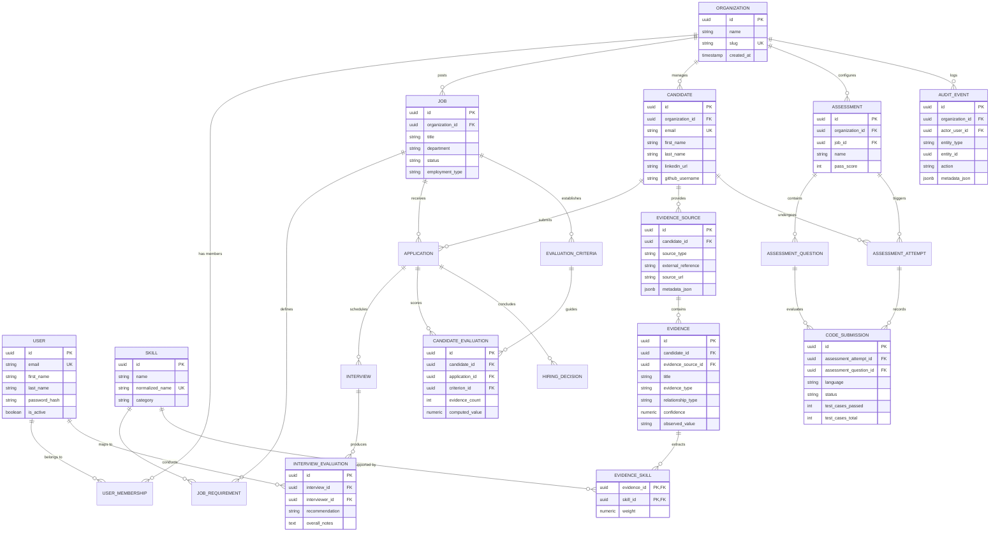

# TalentGraph Data Model & Evidence Graph Architecture

## Overview
TalentGraph uses a **multi-tenant PostgreSQL database** managed by versioned Flyway migrations (`V1__initial_schema.sql`). All entities strictly enforce multi-tenant isolation via `organization_id` foreign key relationships.

The core innovation of TalentGraph is the **Evidence Graph**, which decouples raw candidate proof (resumes, GitHub repos, code submission test results, interview evaluations) from subjective scoring. Scores are deterministically calculated based on verified evidence nodes linked to specific normalized skills and job requirements.

---

## Entity Relationship Diagram

---

## Core Domain Modules

### 1. Multi-Tenant Core (`com.talentgraph.organization`, `com.talentgraph.auth`)
- **`Organization`**: Multi-tenant workspace identified by unique `slug`.
- **`User`**: Account identity across organizations.
- **`OrganizationMember`**: Connects users to organizations with explicit roles (`ADMIN`, `RECRUITER`, `INTERVIEWER`, `HOLDER`).

### 2. Job & Candidate Pipeline (`com.talentgraph.job`, `com.talentgraph.candidate`)
- **`Job`**: Requisition posted by an organization (`DRAFT`, `OPEN`, `PAUSED`, `CLOSED`).
- **`JobRequirement`**: Specific skill requirements mapped to `Skill` with `RequirementType` (`MUST_HAVE`, `NICE_TO_HAVE`) and `Importance` (`CRITICAL`, `HIGH`, `MEDIUM`, `LOW`).
- **`Candidate`**: Multi-tenant applicant profile linked to an organization.
- **`Application`**: Application lifecycle tracking candidate against a job (`APPLIED`, `SCREENING`, `ASSESSMENT_PENDING`, `INTERVIEW_SCHEDULED`, `OFFERED`, `HIRED`, `REJECTED`).

### 3. Evidence Graph Data Engine (`com.talentgraph.evidence`)
- **`Skill`**: Standardized skill catalog (`normalized_name`, `category`).
- **`EvidenceSource`**: Provenance container (`RESUME`, `GITHUB_REPO`, `ASSESSMENT_RUN`, `INTERVIEW_FEEDBACK`).
- **`Evidence`**: Granular evidence claim (e.g., repository commit history, parsed work history, test execution metrics).
- **`EvidenceSkill`**: Composite join table mapping `Evidence` to `Skill` with verifiable `weight` (0.0 to 1.0).

### 4. Code Execution & Assessments (`com.talentgraph.assessment`)
- **`Assessment`**: Technical evaluation suite.
- **`AssessmentQuestion`**: Code challenge or problem with test cases and points.
- **`AssessmentAttempt`**: Candidate attempt instance (`IN_PROGRESS`, `SUBMITTED`, `EXPIRED`, `EVALUATED`).
- **`CodeSubmission`**: Automated execution record with language, source code, status (`PASSED`, `FAILED`, `TIME_LIMIT_EXCEEDED`, `COMPILATION_ERROR`), memory, and test case pass rates.

### 5. Structured Interviews & Evaluations (`com.talentgraph.interview`, `com.talentgraph.evaluation`)
- **`Interview`**: Scheduled interview event.
- **`InterviewEvaluation`**: Standardized evaluation with recommendation (`STRONG_YES`, `YES`, `NEUTRAL`, `NO`, `STRONG_NO`).
- **`EvaluationCriterion`**: Weighted criteria established per job.
- **`CandidateEvaluation`**: Deterministic score computation snapshot referencing evidence counts and calculation versions.
- **`HiringDecision`**: Final decision audit record (`OFFER_EXTENDED`, `HIRED`, `REJECTED`, `WITHDRAWN`).

### 6. Audit & Governance (`com.talentgraph.audit`)
- **`AuditEvent`**: Append-only system audit log capturing actor, entity, action, and JSON payload metadata for compliance and AI decision transparency.
